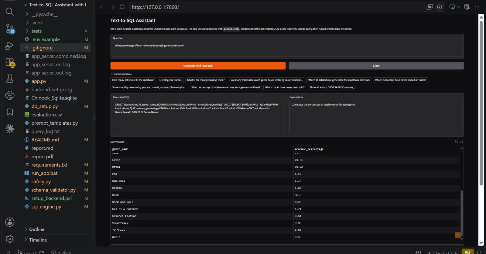

# Text-to-SQL Assistant with LangChain and Gradio

This project is a local Text-to-SQL assistant for the Chinook SQLite database. It accepts a natural-language question, generates SQLite SQL with LangChain and Ollama, validates that the query is read-only, executes it, and displays the generated SQL, explanation, results, and status in Gradio.

## Demo



## Features

- Natural-language question input through Gradio.
- LangChain LCEL pipeline using `ChatPromptTemplate`, `ChatOllama`, and `StrOutputParser`.
- Live schema context extracted from `Chinook_Sqlite.sqlite`.
- Generated SQL is shown before results are displayed.
- Only safe read-only `SELECT` or `WITH ... SELECT` queries are allowed.
- Destructive keywords are blocked in both user questions and generated SQL.
- Results are displayed in a Gradio `DataFrame`.
- Invalid, unsafe, or unanswerable questions return clear status messages.
- All questions, generated SQL, and execution statuses are logged to `query_log.txt`.
- A single SQL repair attempt is made when generated SQL fails validation or execution.
- Backend readiness is checked when the page loads and with the **Check backend** button.
- SQLite connections enforce read-only access; queries have a 15-second execution budget.
- Model responses use JSON mode with an 8192-token context and a 180-second HTTP timeout.

Conversation memory for follow-up questions is not implemented.

## Project Structure

```text
app.py                  Gradio interface and event wiring
sql_engine.py           Text-to-SQL chain, validation, execution, repair, logging
prompt_templates.py     Prompt templates with schema and question variables
db_setup.py             SQLite setup, optional download, schema extraction, execution
safety.py               SQL and user-question safety validation
schema_validator.py     SQLite EXPLAIN validation of identifiers, scopes, and syntax
Chinook_Sqlite.sqlite   Chinook SQLite database
evaluation.csv          Evaluation sheet with expected/generated SQL and pass/fail notes
report.md               Written report source
report.pdf              Written report exported as PDF
requirements.txt        Python dependencies
query_log.txt           Runtime log file, created/updated by the app
```

## Requirements

- Python 3.11 or newer (verified with Python 3.12).
- Ollama installed and running locally.
- The `llama3.1:8b` Ollama model, unless you configure another model with `OLLAMA_MODEL`.

## Setup

1. Create and activate a virtual environment:

```powershell
python -m venv .venv
.\.venv\Scripts\Activate.ps1
```

2. Install dependencies:

```powershell
python -m pip install -r requirements.txt
```

3. Install and start Ollama, then pull the default model:

```powershell
ollama pull llama3.1:8b
ollama serve
```

If `ollama serve` is already running, keep that terminal open and continue in another terminal.

For this Windows project, `powershell -ExecutionPolicy Bypass -File .\setup_backend.ps1` installs Ollama if missing, resumes its download, verifies the installer signature, pulls the configured model, and runs a live SQL generation check. Progress is saved in `backend_setup.log`. The installer and model require several GB of downloads. This helper starts the default local service at `127.0.0.1:11434`; use the manual setup for a remote/custom service.

4. Confirm the database is present:

```powershell
Test-Path .\Chinook_Sqlite.sqlite
```

If the file is missing, `db_setup.py` will try to download it automatically from the public Chinook database repository. If automatic download fails, manually download `Chinook_Sqlite.sqlite` and place it in the project root.

## Run the App

```powershell
.\.venv\Scripts\python.exe app.py
```

Open the local Gradio URL printed in the terminal, usually:

```text
http://127.0.0.1:7860
```

## Optional Configuration

You can override the Ollama model and base URL with environment variables:

Alternatively, copy `.env.example` to `.env` in the project directory and edit it.

```powershell
$env:OLLAMA_MODEL = "llama3.1:8b"
$env:OLLAMA_BASE_URL = "http://localhost:11434"
python app.py
```

## Database Schema Summary

The app uses the Chinook Music Store database. `db_setup.py` extracts the live schema from SQLite metadata at runtime and injects it into the prompt.

Main tables:

- `Artist(ArtistId, Name)`
- `Album(AlbumId, Title, ArtistId)`
- `Track(TrackId, Name, AlbumId, MediaTypeId, GenreId, Composer, Milliseconds, Bytes, UnitPrice)`
- `Genre(GenreId, Name)`
- `MediaType(MediaTypeId, Name)`
- `Playlist(PlaylistId, Name)`
- `PlaylistTrack(PlaylistId, TrackId)`
- `Customer(CustomerId, FirstName, LastName, Company, Address, City, State, Country, PostalCode, Phone, Fax, Email, SupportRepId)`
- `Employee(EmployeeId, LastName, FirstName, Title, ReportsTo, BirthDate, HireDate, Address, City, State, Country, PostalCode, Phone, Fax, Email)`
- `Invoice(InvoiceId, CustomerId, InvoiceDate, BillingAddress, BillingCity, BillingState, BillingCountry, BillingPostalCode, Total)`
- `InvoiceLine(InvoiceLineId, InvoiceId, TrackId, UnitPrice, Quantity)`

Important relationships:

- `Album.ArtistId -> Artist.ArtistId`
- `Track.AlbumId -> Album.AlbumId`
- `Track.GenreId -> Genre.GenreId`
- `Track.MediaTypeId -> MediaType.MediaTypeId`
- `Invoice.CustomerId -> Customer.CustomerId`
- `InvoiceLine.InvoiceId -> Invoice.InvoiceId`
- `InvoiceLine.TrackId -> Track.TrackId`
- `PlaylistTrack.PlaylistId -> Playlist.PlaylistId`
- `PlaylistTrack.TrackId -> Track.TrackId`
- `Customer.SupportRepId -> Employee.EmployeeId`
- `Employee.ReportsTo -> Employee.EmployeeId`

## Safety Rules

The app blocks destructive or non-read-only SQL. The following keywords are rejected:

```text
INSERT, UPDATE, DELETE, DROP, ALTER, CREATE, TRUNCATE, REPLACE,
PRAGMA, ATTACH, DETACH, VACUUM
```

Only one SQL statement is allowed. SQL comments and multi-statement inputs are rejected.

Example unsafe question:

```text
Show all artists; DROP TABLE Customer;
```

Expected behavior: the app blocks the request before sending it to the LLM.

## Evaluation

`evaluation.csv` contains more than 20 test questions with:

- `Level`
- `Question`
- `Expected SQL`
- `Generated SQL`
- `Pass/Fail`
- `Notes`

The current sheet contains 30 evaluated cases:

- 5 simple questions.
- 7 intermediate questions.
- 6 advanced questions.
- 2 edge cases.
- 6 advanced extra analytical questions.
- 4 safety tests.

All current rows are marked `PASS`. The sheet includes simple questions, joins, aggregations, advanced analytical queries, edge cases, and destructive SQL safety tests.

## Report

The short report is available in:

```text
report.md
report.pdf
```

It includes the architecture diagram, technical challenges, failure case analysis, and improvement suggestions.

## Troubleshooting

A visible Gradio page only confirms that the web server is running. Generating SQL also requires the separate Ollama service and the configured model. The **Backend readiness** field reports connection and missing-model errors, including the command to fix them. Click **Check backend** after fixing the service.

On Windows, `run_app.bat` starts the project virtual environment and keeps startup errors visible in its console.

Dependencies in `requirements.txt` are pinned to the versions verified for this fix. To run the regression suite:

```powershell
.\.venv\Scripts\python.exe -m unittest discover -s tests -v
.\.venv\Scripts\python.exe -m tests.gradio_smoke
```

The suite uses mocked model output with the real SQLite database; live model generation requires Ollama.

If the app returns an Ollama connection error:

1. Check that Ollama is installed.
2. Start Ollama with `ollama serve`.
3. Pull the model with `ollama pull llama3.1:8b`.
4. Confirm `OLLAMA_BASE_URL` is `http://localhost:11434`.

If the database is missing:

1. Run the app once and allow automatic download.
2. If download fails, place `Chinook_Sqlite.sqlite` in the project root manually.

If a generated query fails:

1. Check the displayed SQL.
2. Check the status/error message.
3. Review `query_log.txt` for the question, SQL, and failure status.
